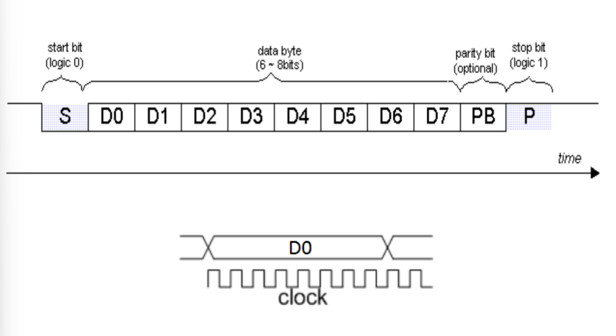
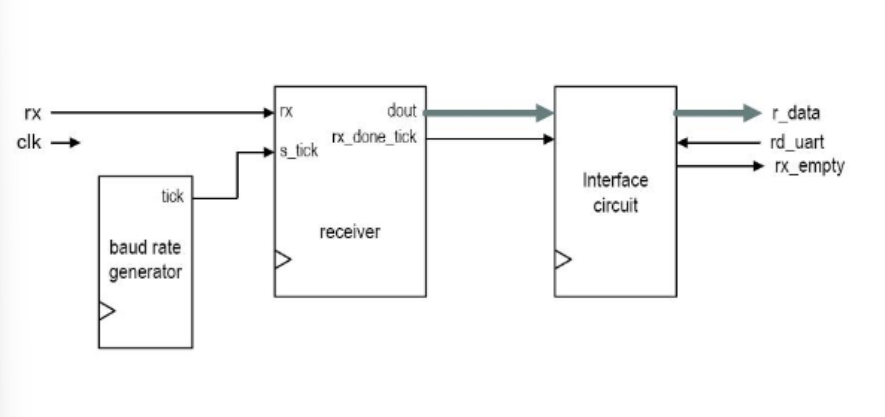
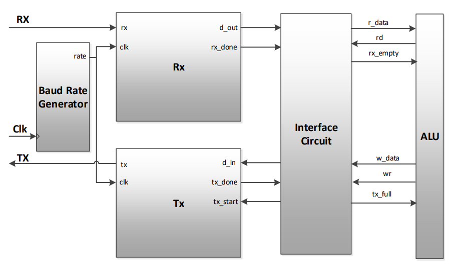

# Informe de trabajo práctico Nº 2 de arquitectura de computadoras 2026
### Profesor: Alonso Pereyra Martín
###  Estudiantes: Potinski Mijail Andrés, Cisneros Tomás Alejo.

 

## 1. Objetivos y consignas

El objetivo del presente trabajo práctico es diseñar e implementar un sistema de comunicación serie basado en el protocolo UART (Universal Asynchronous Receiver and Transmitter), integrándolo con la ALU desarrollada previamente. Para ello se busca aplicar los conceptos de máquinas de estados finitas (FSM) al diseño de lógica secuencial, utilizando distintos estados para controlar las etapas involucradas en la recepción, procesamiento y transmisión de información.

La comunicación UART permite realizar una transferencia de datos de forma asíncrona, es decir, sin transmitir una señal de reloj junto con los datos. Por este motivo, el sistema debe generar internamente una referencia temporal a partir del reloj de la placa mediante un Baud Rate Generator, que proporciona los ticks utilizados para determinar correctamente los instantes de muestreo de cada bit recibido.

El trabajo busca además comprender la organización modular de un sistema digital de comunicación, separando las funciones de generación de temporización, recepción, transmisión e interfaz con la ALU. De esta manera, los datos recibidos en forma serial son reconstruidos en palabras de 8 bits, entregados al circuito de interfaz y utilizados para interactuar con la ALU. De manera análoga, los resultados o datos provenientes de la ALU pueden ser enviados hacia el exterior mediante el transmisor UART.

## 2. Funcionamiento del sistema

El sistema tiene como finalidad permitir la comunicación entre la ALU y un dispositivo externo mediante una interfaz UART (*Universal Asynchronous Receiver and Transmitter*). Para ello, la arquitectura se divide en diferentes bloques encargados de generar la temporización necesaria, recibir y transmitir información serial, administrar el intercambio de datos y realizar el procesamiento correspondiente en la ALU.

La comunicación UART es de tipo asíncrona, por lo que no se transmite una señal de reloj junto con los datos. En consecuencia, transmisor y receptor deben trabajar con una velocidad de comunicación previamente establecida. Los datos se envían mediante tramas formadas por un bit de inicio, los bits de información y uno o más bits de parada, pudiendo incluir además un bit de paridad de forma opcional.

La arquitectura general está compuesta por un **Baud Rate Generator**, un **receptor UART**, un **transmisor UART**, un **circuito de interfaz** y la **ALU**. La interacción entre estos bloques permite recibir información en forma serial, procesarla internamente como datos paralelos y posteriormente transmitir el resultado nuevamente en forma serial.

### Baud Rate Generator

El **Baud Rate Generator** tiene como función proporcionar la referencia temporal utilizada durante la comunicación UART.

Debido a que el protocolo UART no transmite una señal de reloj junto con los datos, el receptor debe determinar internamente los instantes en los que debe observar la línea de entrada. Para ello se genera una señal de `tick` a partir del reloj principal del sistema.

El esquema utilizado emplea un sobremuestreo de **16 veces el Baud Rate**, por lo que durante el período correspondiente a cada bit se generan 16 ticks. Por ejemplo, para una velocidad de comunicación de 19.200 baudios se requiere una frecuencia de muestreo de:

19.200 × 16 = 307.200 ticks/s

El uso de estos ticks permite establecer una referencia temporal común para controlar las distintas etapas de recepción y transmisión de las tramas UART.

### Receptor UART (Rx)

El **receptor UART** tiene como función recibir la información proveniente de la línea serial `RX` y reconstruir a partir de ella el dato transmitido.

En condición de reposo, la línea permanece en nivel lógico alto. El comienzo de una nueva trama se detecta cuando la señal pasa a nivel bajo, indicando la presencia del bit de Start. En ese momento comienza el conteo de los ticks generados por el Baud Rate Generator.

Para verificar correctamente el comienzo de la trama, el receptor espera aproximadamente la mitad del período correspondiente al bit de Start. Con un sobremuestreo de 16 veces, esto implica esperar aproximadamente 8 ticks antes de volver a observar la entrada.

Una vez validado el Start Bit, el receptor espera períodos de 16 ticks para desplazarse aproximadamente hasta el centro de cada uno de los bits siguientes. En esos instantes se toma el valor presente en la entrada y se incorporan progresivamente los bits recibidos hasta reconstruir la palabra completa.

Una vez recibidos los bits de datos, el receptor continúa con la parte final de la trama, correspondiente al bit de Stop. Finalizada correctamente esta secuencia, el dato queda disponible en forma paralela para ser utilizado por el resto del sistema.

El proceso de recepción puede resumirse como:

`Reposo → detección de Start → validación de Start → recepción de datos → Stop → dato disponible`

*Figura 1. Estructura general de una trama UART compuesta por bit de Start, bits de datos, paridad opcional y bit(s) de Stop.*

### Interfaz

El **modulo de interfaz** actúa como intermediario entre el subsistema UART y la ALU. Su función principal es coordinar el intercambio de datos entre ambos bloques, desacoplando la comunicación serial de la forma de trabajo interna del sistema.

El receptor y el transmisor UART se encargan de convertir la información entre una representación serial y una representación paralela. A partir de ese punto, la comunicación con el circuito de interfaz se realiza mediante palabras de datos y señales de control que indican cuándo existe información disponible y cuándo puede realizarse una transferencia.

En el camino de recepción intervienen las señales `r_data`, `rx_empty` y `rd`. La señal `r_data` contiene el byte recibido por UART, mientras que `rx_empty` indica si existe o no un dato pendiente de lectura. Cuando `rx_empty` se encuentra activa, no hay información disponible; cuando se desactiva, el dato presente en `r_data` puede ser leído por la interfaz. Una vez utilizado dicho dato, la interfaz activa `rd` para indicar que la lectura fue realizada y que el receptor puede liberar ese dato y quedar a la espera de uno nuevo.

Por lo tanto, el intercambio en recepción puede representarse conceptualmente como:

`dato recibido → rx_empty = 0 → lectura de r_data → rd → rx_empty = 1`

En el camino de transmisión se utilizan las señales `w_data`, `wr` y `tx_full`. La señal `w_data` contiene el byte que la interfaz desea transmitir. Antes de entregarlo, la interfaz verifica `tx_full`, que indica si el sistema de transmisión puede aceptar un nuevo dato. Cuando existe espacio disponible, el dato se coloca sobre `w_data` y se activa `wr`, indicando que debe ser tomado para su posterior transmisión mediante `TX`.

El intercambio en transmisión puede resumirse como:

`tx_full = 0 → colocar dato en w_data → wr → transmisión UART`

Estas señales constituyen un mecanismo de sincronización entre bloques: la interfaz no necesita conocer en qué bit de una trama se encuentra el receptor o el transmisor, sino únicamente si existe un dato disponible para leer o si puede entregar uno nuevo para transmitir.

Internamente, el receptor informa la finalización de una trama mediante `rx_done` y entrega el dato recibido. De manera análoga, el transmisor recibe una orden de inicio mediante `tx_start` y utiliza `tx_done` para indicar que la transmisión ha finalizado. De esta forma, el circuito UART encapsula los detalles temporales propios de la comunicación serial y presenta hacia la interfaz un mecanismo de transferencia basado en palabras completas.

*Figura 1. Diagrama del Baud Rate Generator, receptor UART y circuito de interfaz.*

### Transmisor UART (Tx)

El **transmisor UART** cumple la función complementaria al receptor: toma un dato disponible internamente en forma paralela y permite enviarlo hacia el exterior mediante la línea serial `TX`.

Para realizar la transmisión, el dato debe incorporarse dentro de una trama UART. La línea se mantiene inicialmente en estado lógico alto y, al comenzar una nueva transmisión, se genera el bit de Start llevando la señal a nivel bajo.

A continuación se transmiten los bits correspondientes al dato y finalmente se genera el bit de Stop, retornando la línea al nivel lógico alto.

La duración de cada una de estas etapas queda determinada por la referencia temporal generada por el Baud Rate Generator.

De esta forma, el transmisor permite convertir los datos utilizados internamente por el sistema en la secuencia serial necesaria para realizar la comunicación UART.

### ALU

La **ALU** constituye el bloque encargado del procesamiento de los datos dentro del sistema.

A diferencia de la comunicación UART, que maneja la información de manera serial, la ALU trabaja con palabras paralelas. Por este motivo, los datos recibidos deben atravesar previamente el receptor UART y el circuito de interfaz antes de poder ser utilizados por este bloque.

La comunicación permite proporcionar a la ALU los datos necesarios para realizar una operación y, una vez obtenido el resultado, entregarlo nuevamente al circuito de interfaz para que pueda ser transmitido hacia el exterior.

De esta forma, la UART funciona como el medio de comunicación de entrada y salida, mientras que la ALU permanece como el bloque encargado de realizar el procesamiento de la información.

### Integración del sistema

Considerando todos los módulos en conjunto, el funcionamiento comienza con la llegada de información mediante la línea `RX`.

El receptor UART utiliza los ticks provenientes del Baud Rate Generator para identificar correctamente el comienzo de una trama y muestrear los bits recibidos. Una vez completada la recepción, la información queda disponible como una palabra paralela.

El circuito de interfaz recibe estos datos y coordina su transferencia hacia la ALU. Una vez que se dispone de la información necesaria, la ALU realiza el procesamiento correspondiente y genera un resultado.

Posteriormente, dicho resultado vuelve a atravesar el circuito de interfaz, que coordina su entrega al transmisor UART. El transmisor convierte entonces el dato paralelo nuevamente en una trama serial y lo envía hacia el exterior mediante la línea `TX`.

El flujo general de información puede representarse como:

`RX → Receptor UART → Circuito de interfaz → ALU → Circuito de interfaz → Transmisor UART → TX`

El Baud Rate Generator proporciona en paralelo la referencia temporal necesaria para los módulos UART.

De esta manera, el sistema completo permite recibir información serial, transformarla en datos utilizables internamente, procesarla mediante la ALU y transmitir nuevamente el resultado a través de una comunicación UART.

*Figura 2. Integración del sistema completo: Baud Rate Generator, receptor UART, transmisor UART, circuito de interfaz y ALU.*

## 3. Implementación sobre Basys 3

### 3.1 Diseño RTL

La arquitectura conceptual presentada anteriormente fue implementada en Verilog mediante una estructura modular, donde cada bloque del sistema se encuentra definido de forma independiente y posteriormente es integrado en niveles superiores de la jerarquía.

La implementación se divide en los módulos encargados de generar la temporización UART, recibir y transmitir datos, administrar los buffers de comunicación, controlar la secuencia de carga de la ALU y finalmente integrar todos los bloques en el módulo superior.

#### Baud Rate Generator

El módulo `baud_rate_generator` se encarga de generar la señal de `tick` utilizada como referencia temporal por los módulos UART. Para ello recibe como parámetros la frecuencia del reloj principal, el Baud Rate de la comunicación y el factor de sobremuestreo.

En el diseño se utilizan los siguientes valores:

- Frecuencia de reloj: 100 MHz.
- Baud Rate: 19.200 baudios.
- Factor de sobremuestreo: 16.

A partir de estos parámetros se calcula primero la frecuencia requerida para la señal de `tick`:

`TICK_FREQ_HZ = BAUD_RATE × OVERSAMPLE`

obteniéndose una frecuencia de 307.200 Hz.

Posteriormente se calcula la cantidad de ciclos del reloj principal que deben transcurrir entre dos ticks consecutivos. Para evitar un truncamiento directo de la división, el cálculo del divisor incorpora un redondeo al entero más cercano.

El ancho necesario para el contador se determina automáticamente mediante una función `clog2`, evitando reservar más bits de los necesarios.

El módulo utiliza un contador que se incrementa en cada flanco positivo de `i_clk`. Cuando alcanza el valor correspondiente al divisor, se reinicia y `o_tick` se activa durante un único ciclo de reloj. Durante el resto del tiempo la salida permanece en nivel bajo.

De esta manera se obtiene, a partir del reloj de 100 MHz de la Basys 3, la referencia temporal utilizada por los módulos de recepción y transmisión UART.

#### Receptor UART (Rx)

El módulo `uart_rx` implementa la recepción de una trama UART mediante una máquina de estados finita. La cantidad de bits de datos, bits de Stop y el factor de sobremuestreo se encuentran parametrizados mediante `DATA_BITS`, `STOP_BITS` y `OVERSAMPLE`.

La FSM se encuentra formada por los estados `IDLE`, `START`, `DATA` y `STOP`.

En `IDLE`, el receptor espera detectar un nivel bajo sobre la entrada serial `i_rx`, indicando el comienzo de un posible bit de Start. Cuando esto ocurre, la máquina pasa al estado `START`.

En `START` se utiliza la señal `i_tick` para esperar aproximadamente la mitad del período correspondiente al bit. Con un sobremuestreo de 16, la comprobación se realiza luego de 8 ticks. Si la entrada continúa en nivel bajo, el Start Bit se considera válido y comienza la recepción de datos. Si la señal volvió a nivel alto, se interpreta como una detección inválida y se retorna a `IDLE`.

Durante el estado `DATA`, el contador `sample_count` permite realizar una muestra cada 16 ticks. Cada bit recibido se incorpora progresivamente al registro `data_shift`, mientras que `bit_count` lleva el control de la cantidad de bits recibidos.

Una vez completados los 8 bits de datos, la FSM avanza al estado `STOP`. Allí se espera el período correspondiente al bit de parada. Al finalizar, el contenido de `data_shift` se copia en `o_data` y se genera un pulso en `o_done`, indicando que un nuevo byte se encuentra disponible.

Además, el nivel de la entrada se comprueba al finalizar el bit de Stop. Si este no se encuentra en nivel lógico alto, se activa `o_frame_error`.

Debido a que la señal `i_rx` proviene de un dispositivo externo y es asíncrona respecto de `i_clk`, antes de ser utilizada por la FSM atraviesa dos registros consecutivos, `rx_meta` y `rx_sync`. Esta etapa permite sincronizar la entrada con el dominio de reloj del sistema y reducir el riesgo asociado a metastabilidad.

#### Transmisor UART (Tx)

El módulo `uart_tx` realiza la conversión de una palabra paralela en una trama serial UART. Al igual que el receptor, se encuentra implementado mediante una FSM formada por los estados `IDLE`, `START`, `DATA` y `STOP`.

En estado `IDLE`, la salida `o_tx` permanece en nivel lógico alto y `o_busy` indica que el transmisor se encuentra disponible.

Cuando se recibe un pulso mediante `i_start`, el dato presente en `i_data` se almacena en el registro `data_shift`. Simultáneamente, `o_tx` pasa a nivel bajo para comenzar el bit de Start, `o_busy` se activa y la FSM pasa al estado `START`.

En este estado se mantiene el bit de Start durante 16 ticks. Al finalizar dicho período se coloca en la salida el bit menos significativo del dato y se pasa al estado `DATA`.

Durante `DATA`, cada bit permanece presente en `o_tx` durante 16 ticks. Una vez completado ese período, se avanza al siguiente bit mediante el desplazamiento de `data_shift`. La transmisión se realiza comenzando por el bit menos significativo.

Cuando se han transmitido todos los bits de datos, la salida vuelve a nivel lógico alto y la FSM pasa al estado `STOP`.

En `STOP` se mantiene este nivel durante la cantidad de períodos configurada mediante `STOP_BITS`. Una vez finalizada la trama, `o_busy` vuelve a cero, se genera un pulso en `o_done` y el transmisor retorna al estado `IDLE`.

Las señales `o_busy` y `o_done` permiten que los bloques superiores conozcan el estado del transmisor sin intervenir directamente en la temporización interna de la trama.

#### Módulo UART

El módulo `uart` constituye el nivel de integración del subsistema de comunicación. En su interior se instancian el `baud_rate_generator`, el receptor `uart_rx` y el transmisor `uart_tx`.

La señal `tick` generada por el Baud Rate Generator se comparte entre los módulos de recepción y transmisión, garantizando que ambos utilicen la misma referencia temporal.

Además, el módulo incorpora un buffer de recepción y un buffer de transmisión, ambos con capacidad para almacenar un byte. Estos buffers permiten desacoplar temporalmente el funcionamiento del subsistema UART respecto del controlador.

En el camino de recepción, cuando `uart_rx` completa una trama y activa `rx_done`, el dato recibido se almacena en `rx_buffer`. La señal `o_rx_empty` indica el estado de este buffer.

Cuando existe un byte pendiente de lectura, `o_rx_empty` se encuentra desactivada y el dato permanece disponible mediante `o_r_data`. Cuando el controlador activa `i_rd`, el buffer vuelve a marcarse como vacío.

Si se recibe un nuevo byte antes de que el anterior haya sido leído, se activa durante un ciclo la señal `o_rx_overrun`, permitiendo detectar esta condición.

En el camino de transmisión se utiliza `tx_buffer` para almacenar temporalmente el dato recibido mediante `i_w_data`. Cuando `i_wr` se encuentra activa y el buffer está disponible, el dato se almacena y `o_tx_full` pasa a indicar que existe un byte pendiente.

Cuando el transmisor deja de estar ocupado, el contenido de `tx_buffer` se copia en `tx_data` y se genera internamente un pulso `tx_start`, iniciando una nueva trama UART.

De esta manera, el módulo presenta hacia el exterior una interfaz basada en las señales `r_data`, `rd`, `rx_empty`, `w_data`, `wr` y `tx_full`, mientras que internamente administra los detalles relacionados con `rx_done`, `tx_start`, `tx_busy` y `tx_done`.

#### Controlador ALU-UART

El módulo `alu_uart_controller` implementa la lógica encargada de coordinar la comunicación entre el módulo UART y la ALU.

Su funcionamiento se organiza mediante una máquina de estados finita que administra la recepción secuencial de tres bytes correspondientes al operando A, al operando B y al código de operación.

Los estados `GET_A`, `GET_B` y `GET_OP` esperan la disponibilidad de un dato en el buffer de recepción.

Cuando `i_rx_empty` indica que existe información disponible, el byte presente en `i_r_data` se coloca sobre el bus `o_alu_data`. Al mismo tiempo se activa la señal correspondiente, `o_load_A`, `o_load_B` u `o_load_OP`, para almacenar el dato en el registro adecuado de la ALU.

También se activa `o_rd`, indicando al módulo UART que el byte recibido ya fue consumido.

Luego de cada lectura se utiliza un estado intermedio: `WAIT_A_EMPTY`, `WAIT_B_EMPTY` o `WAIT_OP_EMPTY`. Estos estados esperan que el buffer de recepción vuelva a indicar condición de vacío antes de avanzar hacia la recepción del siguiente byte. Esto evita que el mismo dato sea procesado más de una vez.

Una vez almacenados A, B y OP, la máquina pasa al estado `EXECUTE`. Este estado introduce un ciclo adicional para permitir que la salida combinacional de la ALU se actualice después de cargar el código de operación.

Posteriormente se ingresa a `SEND_RESULT`. En este estado se verifica mediante `i_tx_full` que el buffer de transmisión pueda aceptar un nuevo dato.

Cuando el buffer se encuentra disponible, el resultado de la ALU recibido mediante `i_C` se coloca en `o_w_data` y se genera un pulso en `o_wr`, solicitando su transmisión.

Finalmente, el estado `WAIT_TX_WRITE` completa la operación y retorna a `GET_A`, dejando al sistema preparado para recibir una nueva secuencia de tres bytes.

El flujo implementado por el controlador puede resumirse como:

`A → B → OP → ejecución → transmisión del resultado`

#### ALU registrada

El módulo `alu_registered` reutiliza la arquitectura desarrollada previamente para la ALU, manteniendo registros independientes para los operandos A y B y para el código de operación.

La entrada `i_data` funciona como un bus compartido utilizado para cargar cualquiera de estos registros. Las señales `i_load_A`, `i_load_B` e `i_load_OP` determinan cuál de ellos captura el valor presente en dicho bus.

Los operandos A y B se almacenan mediante dos instancias del módulo parametrizable `reg_nbits`, configuradas con un ancho de `NB_BITS`.

El código de operación se almacena mediante una tercera instancia de `reg_nbits`, configurada con un ancho de 6 bits. En este caso se utilizan únicamente los seis bits menos significativos de `i_data`.

Cada registro realiza la carga de manera síncrona con `i_clk` cuando su correspondiente señal de enable se encuentra activa. La señal `i_rst` permite llevar su salida a cero.

Las salidas de los tres registros alimentan directamente al módulo combinacional `alu`.

Este módulo recibe los operandos `A`, `B` y el código `op`, y genera como resultado `o_C` junto con las señales `o_zero`, `o_carry` y `o_overflow`.

La ALU implementa las operaciones de suma, resta, AND, OR, XOR, desplazamiento aritmético a derecha, desplazamiento lógico a derecha y NOR.

De esta forma, los valores recibidos mediante UART permanecen almacenados y estables mientras la ALU realiza la operación seleccionada.

#### Módulo Top e integración

El módulo `top_alu_uart` constituye el nivel superior del diseño y se encarga de interconectar los tres bloques principales: el módulo UART, el controlador ALU-UART y la ALU registrada.

La instancia `UART` se conecta directamente con las señales externas `i_uart_rx` y `o_uart_tx`.

Entre el módulo UART y el controlador se encuentran las señales utilizadas para el intercambio de información.

Para el camino de recepción se utilizan:

- `r_data`
- `rd`
- `rx_empty`

Mientras que para el camino de transmisión se utilizan:

- `w_data`
- `wr`
- `tx_full`

El controlador se conecta a la ALU registrada mediante el bus `alu_data` y las señales de carga `load_A`, `load_B` y `load_OP`.

El resultado generado por la ALU se encuentra disponible mediante `C` y retorna al controlador para poder ser enviado posteriormente mediante UART.

El valor de `C` también se conecta directamente a `o_leds`, permitiendo visualizar el resultado de la operación sobre los LEDs de la Basys 3.

Las señales de estado de la ALU, `zero`, `carry` y `overflow`, también son expuestas como salidas del módulo superior.

Por último, se mantienen disponibles las señales `o_rx_overrun` y `o_frame_error`, permitiendo detectar errores asociados al subsistema de recepción UART.

La jerarquía final del diseño puede representarse de forma simplificada como:

`top_alu_uart`

`├── uart`

`│   ├── baud_rate_generator`

`│   ├── uart_rx`

`│   └── uart_tx`

`├── alu_uart_controller`

`└── alu_registered`

`    ├── reg_nbits (A)`

`    ├── reg_nbits (B)`

`    ├── reg_nbits (OP)`

`    └── alu`

De esta manera, la implementación conserva una separación clara entre las funciones de comunicación, control y procesamiento. El módulo UART administra la transferencia serial, el controlador coordina la secuencia de datos y la ALU registrada mantiene y procesa los operandos recibidos.

### 3.2. Esquemático

### 3.3. Análisis temporal
El análisis temporal realizado en Vivado muestra que todas las restricciones temporales se cumplen, sin violaciones de setup (dato que llega demasiado tarde al flip-flop) ni hold (dato que cambia demasiado rápido después del flanco). No se registraron endpoints fallidos y el diseño presenta un margen positivo en el ancho de pulso, por lo que puede implementarse correctamente con el reloj definido.

El valor obtenido WPWS = 4,5 ns, nos indica que en el peor caso de ancho de pulso todavía posee un margen positivo de 4,5 ns respecto del mínimo requerido por la FPGA.

## 4. Pruebas en placa

https://github.com/user-attachments/assets/f8cefe6b-41c8-45ba-811f-dfc6756e5fc6

